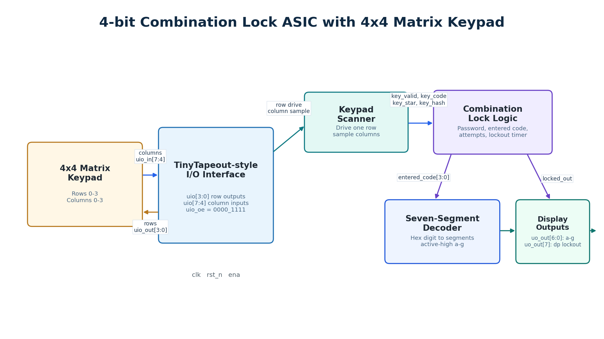
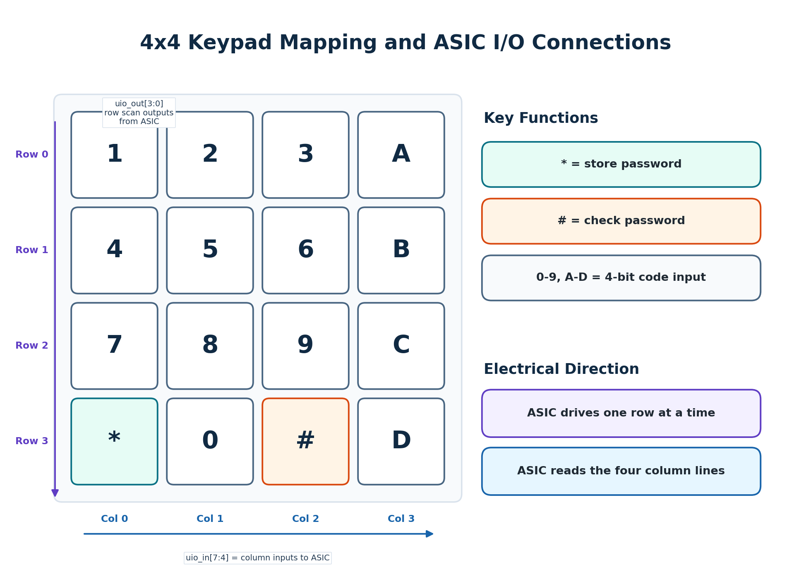

## How it works

### 4-bit combination lock with keypad input

This project implements a 4-bit combination lock for TinyTapeout. It is based on a simple Combination Lock design, with the main modification that password entry uses a standard 4x4 matrix keypad instead of DIP switches.

The design is organized into three functional blocks:

- `keypad_scanner`: scans the keypad matrix by driving one row at a time on `uio_out[3:0]` and reading the column inputs on `uio_in[7:4]`.
- Lock logic: stores the current 4-bit password, accepts keypad code entries, checks the entered code, counts failed attempts, and runs a temporary lockout timer.
- Output/status register: drives an active-high 7-segment display on `uo_out[6:0]` and a decimal-point lockout indicator on `uo_out[7]`.



The keypad rows are active-low scan outputs. The columns are active-low inputs, so an unpressed keypad presents all column inputs high. The bidirectional output enable is fixed to `uio_oe = 8'b0000_1111`, making `uio[3:0]` outputs and `uio[7:4]` inputs. At the top level, `uio_out[3:0]` carries the row scan pattern, `uio_out[7:4]` is driven as 0 on the disabled output path, `uio_in[7:4]` carries the column inputs, and `uio_in[3:0]` is unused.



### Keypad mapping

| Row | Column 0 | Column 1 | Column 2 | Column 3 |
|---|---|---|---|---|
| Row 0 | 1 | 2 | 3 | A |
| Row 1 | 4 | 5 | 6 | B |
| Row 2 | 7 | 8 | 9 | C |
| Row 3 | * | 0 | # | D |

During normal operation, keys `0` through `9` and `A` through `D` load the current 4-bit code. The `*` key stores the current code as the password. The `#` key checks the current code against the stored password.

When the entered code matches the stored password, the lock enters its internal unlocked state. A wrong code increments the internal failed-attempt counter. After three wrong attempts, temporary lockout asserts, `uo_out[7]` lights the decimal point, and an internal temporary lockout timer is loaded.

While temporary lockout is active, normal keypad lock updates are ignored. Code-entry keys do not change the entered code, the `*` key cannot change the password, and the `#` key cannot unlock the design or add more failed attempts. The internal timer counts down from the fixed `LOCKOUT_CYCLES` value. When the timer expires, `locked_out` clears, failed attempts reset to 0, and `unlocked` remains 0 so the user can try entering the password again. Active-low reset clears the timer and lockout state immediately.

The stored password remains in volatile flip-flops during temporary lockout. Reset clears the password to 0 along with the entered code, failed attempts, unlock state, lockout state, and timer. Future work could add EEPROM or FRAM password storage if nonvolatile password retention is required.

The display output format is:

| Output bits | Function |
|---|---|
| `uo_out[6:0]` | active-high 7-segment pattern for the current entered hex digit |
| `uo_out[7]` | decimal point, high during temporary lockout |

The segment bit order is `uo_out[0] = a`, `uo_out[1] = b`, `uo_out[2] = c`, `uo_out[3] = d`, `uo_out[4] = e`, `uo_out[5] = f`, and `uo_out[6] = g`. The active-high hex patterns are `0=0x3f`, `1=0x06`, `2=0x5b`, `3=0x4f`, `4=0x66`, `5=0x6d`, `6=0x7d`, `7=0x07`, `8=0x7f`, `9=0x6f`, `A=0x77`, `B=0x7c`, `C=0x39`, `D=0x5e`, `E=0x79`, and `F=0x71`.

### Pinout interface

The following table summarizes the TinyTapeout interface used by this design.

| TinyTapeout signal | Direction | Function |
|---|---|---|
| `clk` | input | System clock for keypad scanning and lock logic |
| `rst_n` | input | Active-low reset; clears password, entered code, attempts, unlock, lockout state, and lockout timer |
| `ena` | input | Design enable for normal keypad-driven lock updates |
| `ui[7:0]` | input | Unused/reserved in this version |
| `uo[7:0]` | output | 7-segment display plus decimal-point lockout indicator |
| `uio[7:0]` | bidirectional | 4x4 keypad interface: rows on `uio[3:0]`, columns on `uio[7:4]` |

## How to test

Run the TinyTapeout Cocotb testbench from the repository root:

```sh
make -C test
```

Expected result:

```text
PASS
```

The Cocotb test verifies:

- Reset behavior
- Keypad row scanning
- `uio_oe = 8'b0000_1111`
- Password storage using `*`
- Password checking using `#`
- 7-segment output patterns on `uo_out[6:0]`
- Decimal-point lockout indication on `uo_out[7]`
- Temporary lockout behavior after three wrong attempts
- Ignored keypad updates during temporary lockout
- Lockout timeout recovery and a successful password check after the timer expires

Optional local visual inspection:

- Open [docs/gds/tt_um_combolock.gds](gds/tt_um_combolock.gds) in the TinyTapeout GDS Viewer.
- Check [docs/images/rtl_waveform_capture.png](images/rtl_waveform_capture.png) for RTL simulation waveform evidence.
- Check [docs/images/klayout_view.png](images/klayout_view.png) for final layout inspection.
- Check [docs/images/tinytapeout_3d_view.png](images/tinytapeout_3d_view.png) for the TinyTapeout 3D layout view.

Physical verification and manufacturability evidence is kept in [reports/](../reports/), including DRC, LVS, antenna, final metrics, and manufacturability reports.

## External hardware

This design is intended to be used with a standard 4x4 matrix keypad. The ASIC drives the row lines and reads the column lines through the TinyTapeout bidirectional `uio` pins.

| Keypad signal | TinyTapeout signal |
|---|---|
| Row 0 | `uio[0]` |
| Row 1 | `uio[1]` |
| Row 2 | `uio[2]` |
| Row 3 | `uio[3]` |
| Column 0 | `uio[4]` |
| Column 1 | `uio[5]` |
| Column 2 | `uio[6]` |
| Column 3 | `uio[7]` |

The dedicated `ui_in[7:0]` inputs are unused/reserved in this version.

The 7-segment display outputs are active-high. Use suitable current-limiting resistors or an external display driver as required by the display hardware.

| Display signal | TinyTapeout signal | Notes |
|---|---|---|
| Segment a | `uo[0]` | active-high |
| Segment b | `uo[1]` | active-high |
| Segment c | `uo[2]` | active-high |
| Segment d | `uo[3]` | active-high |
| Segment e | `uo[4]` | active-high |
| Segment f | `uo[5]` | active-high |
| Segment g | `uo[6]` | active-high |
| Decimal point | `uo[7]` | high during temporary lockout |
